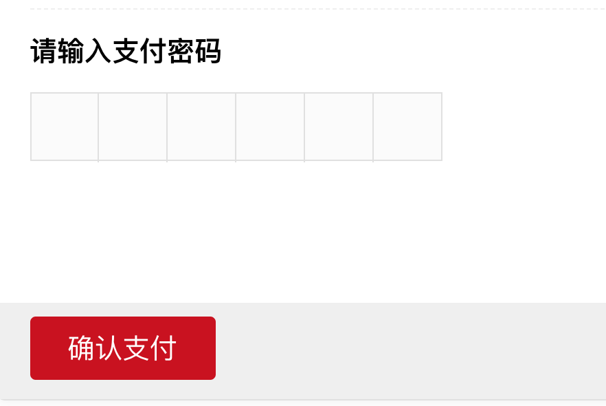

# 支付密码组件开发

### 1. 项目需求：项目中支付页面需要输入支付密码进行支付，密码六位数，隐藏密码输入，每输入一位密码，输入密码位自动切换到下一位，类似支付宝密码输入。根据需求，基于 vue 写了一个简单的密码输入框组件。vue版本：2.6.10.

### 2.代码如下：

- 模板

```
<template>
  <div class="password-container">
    <input ref="pwd"
           type="tel"
           maxlength="6"
           autofocus
           v-model="password"
           style="position: absolute;z-index: -1;left:-100%;opacity: 0" />
    <ul class="pwd-wrap"
        @click="focus">
      <li><i v-if="valLength > 0"></i></li>
      <li><i v-if="valLength > 1"></i></li>
      <li><i v-if="valLength > 2"></i></li>
      <li><i v-if="valLength > 3"></i></li>
      <li><i v-if="valLength > 4"></i></li>
      <li><i v-if="valLength > 5"></i></li>
    </ul>
  </div>
</template>
```

#### 分析： 使用 ul 元素仿造一个 6 位数的密码输入框,li 元素控制密码位数，i 元素控制是否输入密码。原理是点击 ul 元素触发隐藏的 input 输入框，限制输入值的长度为 6 位，监听 input 的值，根据长度控制是否显示 i 元素。

- JS 代码

```
<script>
export default {
  name: "password",
  props: {
    value: {
      type: [String, Number],
      default: ""
    }
  },
  data() {
    return {
      password: "", // 密码值
      valLength: 0 //input输入框值的长度
    };
  },
  created() {
    this.password = String(this.value);
    this.valLength = this.password.length;
  },
  computed: {},
  watch: {
    //监听组件外部密码值的变化，更新组件内的密码值
    value(val, oldVal) {
      if (val != oldVal) {
        this.password = val;
      }
    },
    // 监听组件内密码值的变化，将值传递给父组件
    password(curVal, oldval) {
      if (curVal !== oldval) {
        this.valLength = curVal.length;
        this.$emit("input", curVal);
        this.$emit("changeItem", curVal);
      }
    }
  },
  methods: {
    // 点击ul元素，触发input输入框焦点
    focus() {
      this.$refs.pwd.focus();
    }
  }
};
</script>
```

- style 样式

```
<style lang="scss" scoped>
.password-container {
  position: relative;
}
.pwd-wrap {
  width: 300px;
  height: 50px;
  margin-left: 25px;
  background: #fcfcfc;
  border: 1px solid #e6e6e6;
  display: flex;
  cursor: pointer;
}
.pwd-wrap li {
  width: 50px;
  height: 50px;
  line-height: 50px;
  box-sizing: border-box;
  list-style-type: none;
  text-align: center;
  flex: 1;
  border-right: 1px solid #e6e6e6;
}
.pwd-wrap li:last-child {
  border-right: 0;
}
.pwd-wrap li i {
  height: 10px;
  width: 10px;
  border-radius: 50%;
  background: #000;
  display: inline-block;
}
</style>
```
#### 密码输入前： 
#### 密码输入后： 

### 3. 组件的使用

```
 <input-password v-model="password"
                        @changeItem="pswChange"></input-password>

export default {
    data() {
        password: '',
    },
    methods: {
        pswChange(password) {
            console.log(password)
        }
    }
}
```
