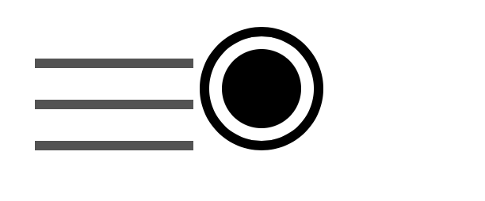

# 《CSS 世界》-张鑫旭

### 文章为读书笔记。拜读此书后，对书中的实用技巧做了笔记，文中的实战技巧及案例出自此书。

## 《CSS 世界》读书笔记系列一

### 1. 百分比 padding 值与等比例头图效果

#### 分析：网页开发中会有横穿整个屏幕的 banner 图，通常是设置宽度 100%；高度固定某个像素值，但是在屏幕大小发生变化时，图片无法等比例实现自适应。如果使用 padding 百分比设置可以实现宽高等比例自适应。

- html 代码

```
<div class="box">
    
</div>
```

- css 代码

```
.box {
    padding: 10% 50%;
    position: relative;
}
.box > img {
    position: absolute;
    width: 100%; height: 100%;
    left: 0; top: 0;
}
```

- 案例来源：https://demo.cssworld.cn/4/2-3.php

### 2.解决原生 button 元素在不同浏览器下不一致的情况

#### 分析： 原生 button 元素的 padding 与高度计算在不同浏览器下差异很大，为了统一，可以使用 label 元素解决。可以在 label 元素上自定义按钮样式，label 中的 for 绑定 button 元素的 id 值。代码如下：

- html 代码

```
<button id="btn"></button>
<label for="btn" class="btn-label">确定</label>
```

- css 代码

```
#btn {
    position: absolute;
    clip: rect(0 0 0 0);
}

.btn-label {
    display: inline-block;
    line-height: 20px;
    padding: 10px;
}
```

### 3. 菜单三道杠和双层原点图形效果

- html 代码

```
 <i class="icon-menu"></i>
 <i class="icon-dot"></i>
```

- css 代码

```
.icon-menu {
    display: inline-block;
    width: 100px;
    height: 6px;
    padding: 20px 0;
    border-top: 6px solid #666;
    border-bottom: 6px solid #666;
    background-color: #666;
    background-clip: content-box;
}

.icon-dot {
    display: inline-block;
    width: 50px;
    height: 50px;
    padding: 8px;
    border: 6px solid;
    border-radius: 50%;
    background-color: currentColor; /*currentColor: css变量,继承标签文字的颜色*/
    background-clip: content-box;
}
```



#### 总结:

- background-clip 属性：设置元素的背景（背景图片或颜色）是否延伸到边框下面。是实现图形效果的关键。属性值如下：

| 属性值      | 说明                                             |
| ----------- | ------------------------------------------------ |
| border-box  | 背景延伸至边框外沿（但是在边框下层）             |
| padding-box | 背景延伸至内边距（padding）外沿,不会绘制到边框处 |
| content-box | 背景被裁剪至内容区（content box）外沿            |
| text        | 背景被裁剪成文字的前景色                         |

- currentColor: color 属性对应的关键字值，继承当前或父元素属性 color 的属性值；
  详情参见：https://developer.mozilla.org/zh-CN/docs/Web/CSS/color_value

* 案例来源：https://demo.cssworld.cn/4/2-4.php

### 4. margin 实现列表块两端对齐，中间有相等间隔的效果

#### 分析: 实现列表块排列要求两端对齐，中间有高度定间隔的效果,给列表项父元素添加 margin-right: -20px;

```
ul{　margin-right:-20px;}

ul>li{　float:left;　width:100px;　margin-right:20px;}

```

### 5. margin 实现等高布局

#### 分析：此布局一般是分栏，有背景色或者分割线；左右分栏内容不一样，但是背景色或分割线是等高的；

- 案例来源: https://demo.cssworld.cn/4/3-2.php

### 6. 元素水平垂直方向居中显示

- margin：auto 实现居中

```
<div class="father">
    <div class="son"></div>
</div>

.father {
    width: 300px;
    height: 200px;
    position: relative;
    border: 1px solid #666;
}
.son {
    position: absolute;
    left:0;
    right:0;
    top:0;
    bottom:0;
    width: 150px;
    height: 100px;
    margin: auto;
    background: red;
}
```
