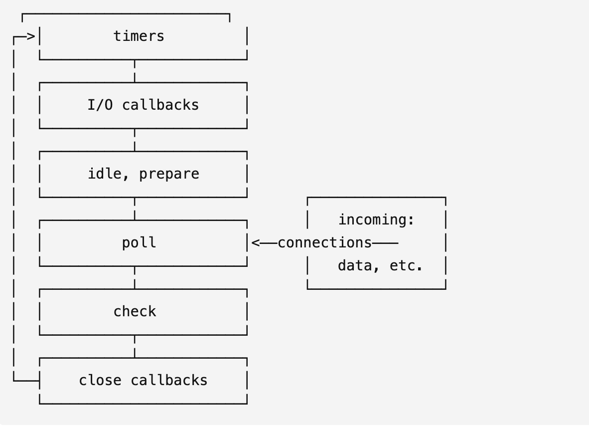

## JavaScript的执行机制-事件循环(EventLoop)

### 一. 关于JavaScript

#### JavaScript 是一门单线程非阻塞的脚本语言，单线程是由执行环境-浏览器决定的，即JS只有一个主线程；因为JS需要与浏览器进行交互，操作dom，若是多线程同时操作同一个dom会引发状态同步等问题，故单线程是必须的。

#### 虽然H5开放了Web Worker，为JS提供了多线程的环境，但是WebWorker并不能操作DOM对象，而且受到主线程的控制，不能独立执行，本质上JS依然是单线程。
#### 另外JS有非阻塞的特点，即遇到异步任务，不会阻碍后面代码的执行，主线程会继续向下执行；而实现这一特点的方法就是事件循环，也就是JS的执行机制。JS所在的宿主环境不同，其执行机制也不相同，本文主要探讨JS在浏览器及Node环境中的执行机制。

- 注意: JS的运行机制由JS解析引擎决定的，在不同的宿主环境下都是统一的。有兴趣的可以自行学习
  
### 二. 浏览器环境中的事件循环

#### 1. 执行栈和事件队列

#### 当js代码执行的时候，js引擎会解析这段代码，并创建全局执行上下文，每次调用函数时，就为该函数创建一个自己的函数执行上下文，不在任何函数内的代码会放到全局执行上下文中。
#### 执行上下文(Execution Context)是什么呢? 就是js代码被解析和执行时所在的环境。一个程序中只能存在一个全局执行上下文，可以有多个函数执行上下文，因为每次函数调用时都会创建一个函数执行上下文。而执行栈就是管理执行上下文的栈结构，遵循先进后出的原则。

#### 从广义上说，js代码分同步和异步。
#### （1）js引擎解析代码时，会将所有的同步代码按顺序加入到执行栈中，然后从栈顶开始执行代码。如果当前执行的是一个方法，js会向执行栈中添加这个方法的执行上下文，并进入到这个执行上下文继续执行其中的代码，执行完毕后返回结果，js退出这个执行上下文并把它销毁，回到上一个执行上下文继续执行其代码，该过程重复进行，直到执行栈中的代码全部执行完毕。图例如下：

#### （2）js对于异步代码的执行：当js引擎遇到一个异步事件后并不会一直等待其返回结果，而是会将这个事件挂起，继续执行执行栈中的其他任务。当这个异步事件返回结果后，js会将这个事件的回调加入到一个队列，我们称之为事件队列。被放入事件队列不会立刻执行其回调，而是等待当前执行栈中的所有任务都执行完毕， 主线程处于闲置状态时，主线程会去查找事件队列是否有任务。如果有，那么主线程会从中取出排在第一位的事件，并把这个事件对应的回调放入执行栈中，然后执行其中的同步代码...，如此反复，这样就形成了一个无限的循环。这个过程被称为“事件循环（Event Loop）”。
- 事件队列又分为：宏任务队列(macro-task queue)和微任务队列(micro-task queue)
  
- macro-task(宏任务)：包括整体代码script，setTimeout，setInterval
- micro-task(微任务)：Promise.then()，process.nextTick
 #### 不同类型的任务会进入到对应的事件队列中。其事件循环流程为：
 - js初始进入执行栈执行代码，开始第一轮事件循环；
 - 当执行栈为空时，js查询微任务队列，如果有任务，则取出第一个任务的回调放入执行栈，然后执行，直到微任务队列为空，第一轮事件循环结束；
 - 当微任务队列为空时，js查询宏任务队列，第二轮事件循环开始，如果有任务，则取出第一个任务的回调放入执行栈，然后执行，直到执行栈为空，js再去查询微任务队列是否有任务，如果有则继续取出放入执行栈执行，直到微任务队列为空，则第二轮事件循环结束，以此重复进行... 直到程序执行完毕。
#### 注意： 同一次事件循环中，微任务永远在宏任务之前执行

### 三. Node环境中的事件循环

#### Node.js引入chrome v8引擎作为js解释器，而Node中处理I/O请求，实现异步编程则由libuv引擎完成，其事件循环也是由libuv引擎实现的。Node中的事件循环有六个阶段，官方图例如下：

   